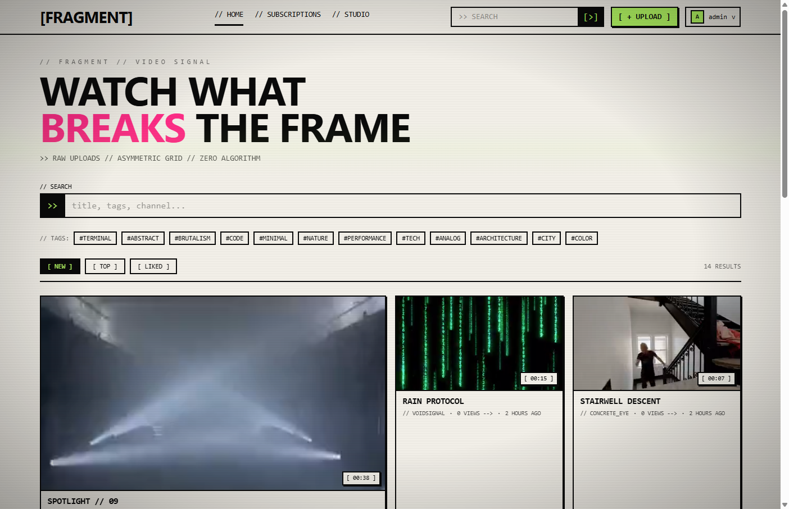
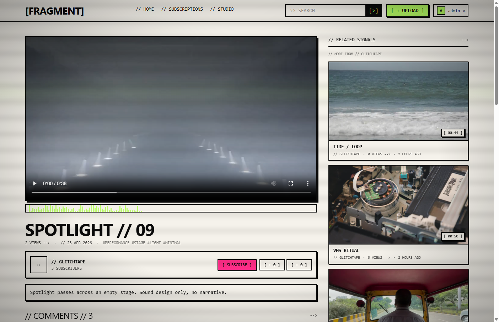
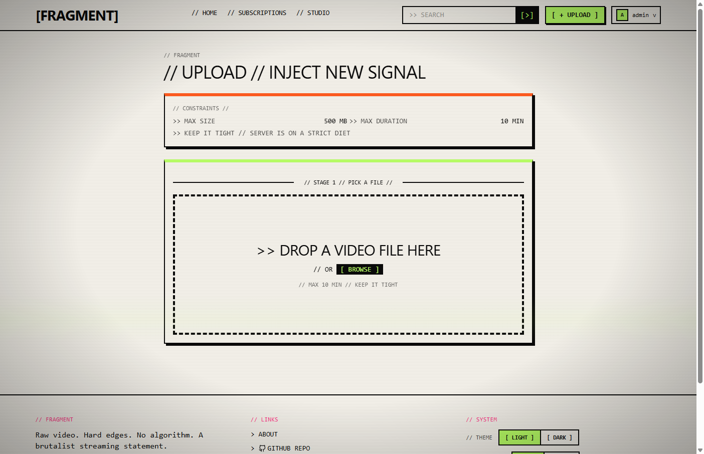
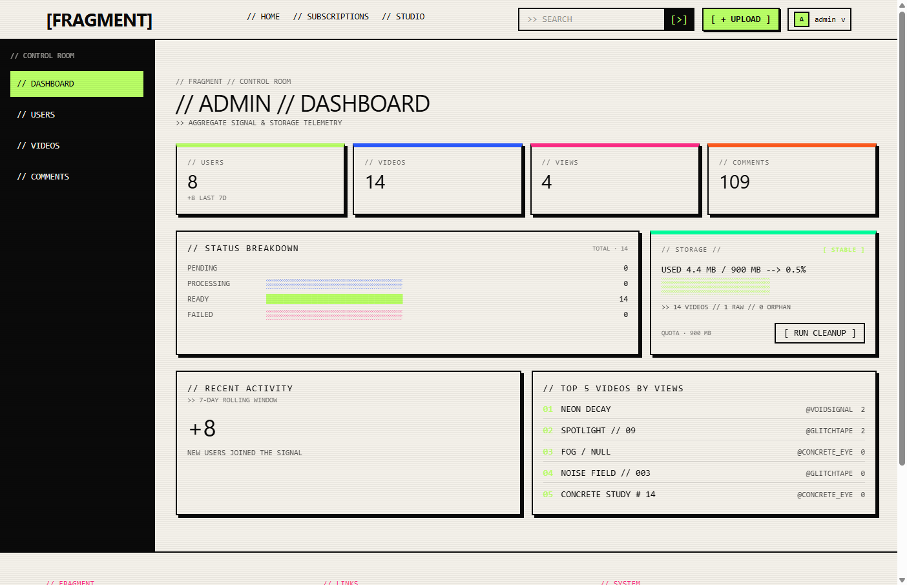

# FRAGMENT

> **Brutalist, glitch-aesthetic video streaming platform.**
> Raw uploads are transcoded server-side with FFmpeg into HLS (`.m3u8` + `.ts`), then streamed to a React 19 client styled like a printed zine.

```
// FRAGMENT // SIGNAL TRANSMITTED // 0001
```

<!-- Replace these placeholders with real screenshots once captured -->

| Home Feed | Video Detail | Upload Studio | Admin Panel |
|---|---|---|---|
|  |  |  |  |

---

## Table of Contents

1. [What is FRAGMENT?](#what-is-fragment)
2. [Tech Stack](#tech-stack)
3. [Features](#features)
4. [What is HLS?](#what-is-hls)
5. [Why TypeScript?](#why-typescript)
6. [System Requirements](#system-requirements)
7. [FFmpeg Installation](#ffmpeg-installation)
8. [Roles & Permissions](#roles--permissions)
9. [API Endpoints](#api-endpoints)
10. [Folder Structure](#folder-structure)
11. [Security](#security)
12. [Getting Started](#getting-started)
13. [Type Checking & Linting](#type-checking--linting)
14. [Deployment](#deployment)
15. [Production Scaling](#production-scaling)
16. [MVP Limitations](#mvp-limitations)
17. [Portfolio Notes](#portfolio-notes)
18. [License](#license)

---

## What is FRAGMENT?

FRAGMENT is a **brutalist, glitch-aesthetic video streaming platform** built as an alternative to the rounded, pastel SaaS norm. Every surface is a 2px ink-black border on cream `#F4F1EA`, monospace typography, hard offset shadows on hover, and decorative `// slashes`, `[ brackets ]`, and `-->` arrows. The UI reads like a printed zine, intentionally aggressive but accessibility-aware (WCAG AA contrast, `prefers-reduced-motion` honored everywhere).

Technically, FRAGMENT is a **full-stack TypeScript monorepo**. Creators upload raw video files which are validated by Zod, accepted by Multer, then transcoded asynchronously by FFmpeg into single-bitrate HLS — a `.m3u8` playlist plus 10-second `.ts` segments — and served by Express through `express.static` with native HTTP Range support. The client uses React Player (HLS.js under the hood) for instant playback, range-aware seeking, and segment-level caching.

The platform supports three roles (**viewer**, **creator**, **admin**), nested comments, like/dislike, channel subscriptions with a personal feed, watch-history with deduplication, a recommendation engine based on creator overlap, and a full admin moderation panel with disk-quota alerting and orphan-file cleanup. Authentication is JWT-based with bcrypt-hashed passwords; every input is validated by **Zod schemas shared between client and server**.

---

## Tech Stack


| Layer | Stack |
|---|---|
| **Client** | React 19 · Vite 8 · TailwindCSS v4 · React Router v7 · Axios · React Player (HLS.js) · Lucide · React Hot Toast |
| **Server** | Node 20 · Express 5 · Mongoose 8 · Multer 2 · fluent-ffmpeg · Helmet · CORS · express-rate-limit · jsonwebtoken · bcryptjs · nanoid |
| **Shared** | TypeScript 5 · Zod 3 (schemas + inferred types) |
| **Database** | MongoDB 6 (local) / MongoDB Atlas (production) |
| **Streaming** | FFmpeg → HLS (single-bitrate, 10s segments) served by `express.static` with native HTTP Range |
| **Deployment** | Fly.io (server + 3 GB persistent volume) · Netlify (client) |

---

## Features

### Viewer

- Browse an asymmetric video grid with search, sort (`new` / `top` / `liked`), and pagination.
- Stream HLS video with instant seek, range requests, and resume-from-history.
- Like / dislike with optimistic UI and one-reaction-per-user enforcement.
- Post nested comments and replies with rate-limited write protection.
- Subscribe to channels and follow a personalized subscription feed.
- Watch history with per-video timestamp deduplication.
- Light / dark / system themes, four accent colors, density and animation preferences (all persisted server-side).

### Creator

- Become a creator from any account with a single API call.
- Drag-and-drop upload with progress bar, size/duration validation, and MIME whitelist.
- Real-time processing status polling (`pending` → `processing` → `ready` / `failed`).
- Studio dashboard listing all own videos by status with edit/delete actions.
- Public channel page with bio, avatar URL, subscriber count, and video grid.
- Auto-generated thumbnails extracted from a configurable timestamp.

### Admin

- KPI dashboard: users, videos, total views, comments, 7-day trends, top videos.
- Disk-usage widget with three-level alerting (`ok` / `warn` / `critical`) and orphan detection.
- One-click cleanup with dry-run mode for raw / orphan / failed-processing artifacts.
- User moderation: search, role change, ban / unban, delete (with last-admin protection).
- Video moderation: search, filter by status, flag, force-delete (cascades comments + likes + files).
- Comment moderation: list, search, delete (cascades replies).
- Self-protection: cannot demote, ban, or delete own account.

---

## What is HLS?

**HLS (HTTP Live Streaming)** is an Apple-originated streaming protocol now supported by every modern browser via [HLS.js](https://github.com/video-dev/hls.js/). FFmpeg splits a source video into:

- A **playlist** (`index.m3u8`) — a small text manifest listing the segment files in order.
- A sequence of **transport-stream segments** (`segment0.ts`, `segment1.ts`, …) — each typically 10 seconds long.

The browser fetches the playlist first, then requests segments sequentially as the user watches. Because each segment is just a normal HTTP file, HLS supports:

- **Instant playback** (the player can start the first segment without downloading the whole file).
- **HTTP Range requests** (the player skips ahead by requesting only the relevant byte range).
- **CDN edge caching** (segments are immutable static files — perfect for cache headers like `Cache-Control: public, max-age=31536000, immutable`).

FRAGMENT transcodes every upload to **single-bitrate HLS** for MVP simplicity. Multi-bitrate adaptive streaming (ABR) is a documented future enhancement.

---

## Why TypeScript?

TypeScript is the project's contract layer:

- **Shared types between client and server** live in the `@fragment/shared` workspace and are consumed by both via the `@shared/*` path alias. A change to a `User` field updates the API response shape, the React component props, and the Zod validator in a single place.
- **Zod schemas double as runtime validators AND compile-time types** via `z.infer<typeof schema>`. The same schema validates incoming `req.body` on the server and powers form validation on the client — impossible to drift.
- **Mongoose `InferSchemaType` removes hand-written model interfaces.** The schema is the source of truth; controllers consume the inferred document type with full IntelliSense and zero duplication.
- **Strict mode everywhere** — `strict`, `noUncheckedIndexedAccess`, `exactOptionalPropertyTypes`, `noImplicitOverride`. No silent `any`.

---

## System Requirements

| Requirement | Version | Notes |
|---|---|---|
| **Node.js** | `>=20.0.0` | Required by all three workspaces. |
| **npm** | `>=10` | Ships with Node 20+. Workspaces are used. |
| **MongoDB** | `>=6.0` | Local instance or MongoDB Atlas free tier. |
| **FFmpeg + FFprobe** | `>=4.4` | **Must be on system `PATH`.** See [installation](#ffmpeg-installation). Bundled inside the production Docker image. |
| **Disk** | ≥ 2 GB free | Local `uploads/`. Production runs on a **3 GB Fly.io persistent volume**. |
| **`flyctl`** | latest | Only required for production deployment. |

---

## FFmpeg Installation

`fluent-ffmpeg` is only a Node wrapper — the actual `ffmpeg` and `ffprobe` binaries must be installed on the host OS and reachable from `PATH`. Without them, **every upload fails at the transcoding stage**.

| OS | Install command |
|---|---|
| **Windows** | Download a static build from <https://ffmpeg.org/download.html>, extract it, and add the `bin/` folder to your system `PATH`. |
| **macOS** | `brew install ffmpeg` |
| **Linux / WSL (Debian/Ubuntu)** | `sudo apt update && sudo apt install -y ffmpeg` |
| **Fly.io (production)** | Pre-installed in the Docker image via `apt install ffmpeg` (see STEP 40 in [`docs/BUILD-GUIDE.md`](./docs/BUILD-GUIDE.md)). |

**Verify the install — both commands must print version info from any shell:**

```bash
ffmpeg -version
ffprobe -version
```

---

## Roles & Permissions

Three roles in a strict hierarchy: `viewer < creator < admin`.

| Capability | Viewer | Creator | Admin |
|---|:---:|:---:|:---:|
| Register / login | ✅ | ✅ | ✅ |
| Browse, search, watch videos | ✅ | ✅ | ✅ |
| Like / dislike, comment, reply | ✅ | ✅ | ✅ |
| Subscribe to channels | ✅ | ✅ | ✅ |
| Watch history, subscription feed | ✅ | ✅ | ✅ |
| Update own profile, preferences, password | ✅ | ✅ | ✅ |
| Become a creator (`POST /api/users/me/become-creator`) | ✅ | — | — |
| Upload videos | — | ✅ | ✅ |
| Edit / delete own videos | — | ✅ | ✅ |
| View own studio dashboard | — | ✅ | ✅ |
| Public channel page | — | ✅ | ✅ |
| Admin dashboard, moderation, cleanup | — | — | ✅ |
| Change roles, ban, delete users | — | — | ✅ |
| Force-delete any video / comment | — | — | ✅ |

**Self-protection:** admins cannot demote, ban, or delete themselves; the system enforces a last-admin guard.

---

## API Endpoints

All routes are mounted under `/api`. Responses follow the uniform shape `{ success: true, data } | { success: false, message, requestId?, errors? }`.

### Auth — `/api/auth`

| Method | Path | Auth | Description |
|---|---|---|---|
| `POST` | `/register` | — | Create account (rate-limited). |
| `POST` | `/login` | — | Issue JWT (rate-limited). |
| `GET` | `/me` | ✅ | Current user profile. |
| `PATCH` | `/me` | ✅ | Update own profile (username, bio, avatar URL). |
| `POST` | `/change-password` | ✅ | Change password (requires current password, rate-limited). |
| `DELETE` | `/me` | ✅ | Delete own account (requires current password). |

### Users — `/api/users`

| Method | Path | Auth | Description |
|---|---|---|---|
| `GET` | `/me/preferences` | ✅ | Read appearance/privacy/notification preferences. |
| `PATCH` | `/me/preferences` | ✅ | Update preferences. |
| `POST` | `/me/become-creator` | ✅ | Promote viewer → creator. |
| `GET` | `/me/history` | ✅ | Personal watch history. |
| `GET` | `/:username` | optional | Public channel profile. |

### Videos — `/api/videos`

| Method | Path | Auth | Description |
|---|---|---|---|
| `GET` | `/` | optional | List videos with search, sort, pagination. |
| `GET` | `/mine` | creator+ | List own videos (any status). |
| `GET` | `/by-channel/:userId` | optional | Videos for a specific channel. |
| `POST` | `/upload` | creator+ | Upload + trigger async HLS transcode (rate-limited, multipart). |
| `GET` | `/:videoId` | optional | Video detail. |
| `GET` | `/:videoId/status` | optional | Polling endpoint for processing status. |
| `GET` | `/:videoId/recommendations` | optional | Related videos (creator-overlap based). |
| `PATCH` | `/:videoId` | creator+ (owner) | Update title, description, visibility. |
| `PATCH` | `/:videoId/view` | optional | Record a deduplicated view (rate-limited). |
| `DELETE` | `/:videoId` | creator+ (owner) | Delete video + HLS files + cascade. |

### Streaming — `/api/stream`

| Method | Path | Auth | Description |
|---|---|---|---|
| `GET` | `/<videoId>/index.m3u8` | — | HLS playlist (served by `express.static`). |
| `GET` | `/<videoId>/segment*.ts` | — | HLS segments (HTTP Range supported natively). |
| `GET` | `/<videoId>/thumbnail.jpg` | — | Auto-generated thumbnail. |

### Likes — `/api/likes`

| Method | Path | Auth | Description |
|---|---|---|---|
| `GET` | `/:videoId/me` | optional | Current user's reaction (or `null`). |
| `POST` | `/:videoId` | ✅ | Set reaction (`+1` like / `-1` dislike). |
| `DELETE` | `/:videoId` | ✅ | Remove reaction. |

### Comments — `/api/comments`

| Method | Path | Auth | Description |
|---|---|---|---|
| `GET` | `/video/:videoId` | optional | Top-level comments for a video. |
| `GET` | `/:commentId/replies` | optional | Nested replies. |
| `POST` | `/` | ✅ | Create comment or reply (rate-limited). |
| `PATCH` | `/:commentId` | ✅ (owner) | Edit own comment. |
| `DELETE` | `/:commentId` | ✅ (owner) | Delete own comment (cascades replies). |

### Subscriptions — `/api/subscriptions`

| Method | Path | Auth | Description |
|---|---|---|---|
| `GET` | `/me` | ✅ | Channels the current user subscribes to. |
| `GET` | `/me/feed` | ✅ | Latest videos from subscribed channels. |
| `GET` | `/:channelId/status` | optional | Whether the current user is subscribed. |
| `POST` | `/:channelId` | ✅ | Subscribe to channel. |
| `DELETE` | `/:channelId` | ✅ | Unsubscribe. |

### Admin — `/api/admin` (admin only, rate-limited)

| Method | Path | Description |
|---|---|---|
| `GET` | `/dashboard/stats` | KPIs, status breakdown, top videos, recent activity. |
| `GET` | `/users` | List/search users. |
| `PATCH` | `/users/:userId/role` | Change role. |
| `PATCH` | `/users/:userId/ban` | Toggle ban. |
| `DELETE` | `/users/:userId` | Force-delete user. |
| `GET` | `/videos` | List/search/filter all videos. |
| `PATCH` | `/videos/:videoId/flag` | Flag/unflag video. |
| `DELETE` | `/videos/:videoId` | Force-delete video. |
| `GET` | `/comments` | List/search all comments. |
| `DELETE` | `/comments/:commentId` | Force-delete comment. |
| `GET` | `/maintenance/disk` | Disk usage report (`ok` / `warn` / `critical`). |
| `POST` | `/maintenance/cleanup` | Run cleanup (raw / orphans / failed; supports dry-run). |

### Health

| Method | Path | Description |
|---|---|---|
| `GET` | `/api/health` | Liveness probe (uptime + status). |

---

## Folder Structure

```
fragment/
├── shared/                          # @fragment/shared workspace
│   ├── constants/enums.ts           # USER_ROLES, VIDEO_STATUSES, ...
│   ├── schemas/                     # Zod schemas (validators + inferred types)
│   │   ├── auth.schema.ts
│   │   ├── user.schema.ts
│   │   ├── video.schema.ts
│   │   ├── comment.schema.ts
│   │   └── admin.schema.ts
│   ├── types/                       # Shared TS interfaces (User, Video, ...)
│   ├── package.json
│   └── tsconfig.json
│
├── server/                          # fragment-server workspace
│   ├── src/
│   │   ├── index.ts                 # Express bootstrap
│   │   ├── config/{env,db}.ts       # Zod-validated env + Mongo connection
│   │   ├── middleware/              # auth, role, validate, rate, sanitize, error
│   │   ├── models/                  # Mongoose: User, Video, View, Like, Comment, Subscription
│   │   ├── routes/                  # auth, users, videos, likes, comments, subs, admin
│   │   ├── controllers/             # Business logic per route
│   │   ├── services/                # ffmpeg.service, processing.service
│   │   ├── utils/                   # logger, asyncHandler, httpError, ...
│   │   ├── seed/
│   │   │   ├── seedAdmin.ts         # Admin bootstrap script
│   │   │   ├── seedDemo.ts          # Demo content seed (3 creators + 14 videos)
│   │   │   └── demo-assets/         # metadata.json + videos/*.mp4 (gitignored)
│   │   └── types/express.d.ts       # req.user augmentation
│   ├── scripts/copy-seed-assets.mjs # Postbuild: src/seed/demo-assets -> dist/...
│   ├── uploads/
│   │   ├── raw/        (.gitkeep)   # Multer destination
│   │   └── processed/  (.gitkeep)   # FFmpeg HLS output (served by express.static)
│   ├── .env.example
│   ├── Dockerfile
│   ├── fly.toml
│   └── tsconfig.json
│
├── client/                          # fragment-client workspace
│   ├── src/
│   │   ├── main.tsx · App.tsx · index.css
│   │   ├── api/                     # Axios instance + endpoint wrappers
│   │   ├── context/                 # Auth, Preferences contexts
│   │   ├── hooks/                   # useAuth, usePreferences, ...
│   │   ├── components/
│   │   │   ├── brutal/              # BrutalButton, BrutalCard, BrutalToggle, ...
│   │   │   ├── layout/              # Navbar, Footer, AdminLayout
│   │   │   ├── video/ · comment/ · upload/ · studio/ · admin/
│   │   │   ├── feedback/            # AsciiSpinner, EmptyState, ErrorBlock
│   │   │   └── guards/              # AuthRoute, CreatorRoute, AdminRoute
│   │   ├── pages/                   # Home, VideoDetail, Upload, Studio, ...
│   │   │   ├── settings/            # Profile, Account, Appearance, Privacy, Notifications
│   │   │   └── admin/               # Dashboard, Users, Videos, Comments
│   │   └── utils/
│   ├── public/                      # Static assets, favicon
│   ├── .env.example
│   ├── vite.config.ts
│   └── tsconfig.json
│
├── package.json                     # Root: workspaces, scripts
├── tsconfig.base.json               # Strict TS settings shared by all workspaces
├── tsconfig.json                    # Composite project references
├── README.md                        # ← you are here
├── docs/
│   ├── BUILD-GUIDE.md               # Archived: original 42-step build playbook
│   ├── MIGRATION-TO-B2.md           # Future B2 + Cloudflare CDN migration plan
│   └── screenshots/                 # README screenshots
└── .gitignore
```

---

## Security

- **JWT auth** — bcrypt-hashed passwords (configurable salt rounds, default 12), signed JWTs with configurable expiry, secret enforced ≥ 32 chars in production.
- **Role-based middleware** — `protect`, `creatorOrAdmin`, `adminOnly`. Ownership checks on every mutation route.
- **Mass-assignment protection** — controllers `pickFields()` from `req.body`; Mongoose schemas use `select: false` on sensitive fields (password hash).
- **Zod validation** on every request body, params, and query. Schemas live in `@fragment/shared` and are reused on the client.
- **Custom NoSQL sanitization** — Express 5–compatible middleware strips `$` / `.` keys (replaces deprecated `express-mongo-sanitize`).
- **Rate limiting** — separate buckets: `globalLimiter` for `/api/*`, `authLimiter` for register/login/password, `uploadLimiter`, `viewLimiter`, `commentLimiter`, `adminLimiter`. Standard `RateLimit-*` headers exposed via CORS.
- **Helmet** — secure defaults; `x-powered-by` disabled.
- **CORS** — single origin from `CLIENT_ORIGIN`, credentials enabled, `X-Request-Id` and `RateLimit-*` headers exposed.
- **Multer hardening** — MIME whitelist, file-size cap (`MAX_UPLOAD_SIZE_MB`), duration cap (`MAX_VIDEO_DURATION_SECONDS`), dedicated `uploads/raw/` destination outside the served directory.
- **HLS streaming** — mounted **before** the global API rate limiter so segment fetches never starve JSON traffic; `dotfiles: 'deny'`, `index: false`, immutable cache headers.
- **Request IDs + structured logging** — every request tagged with `X-Request-Id`; the same id flows into error responses for traceability (`// REF: <id>`).
- **`.env` and `uploads/raw/*` / `uploads/processed/*` never committed** — enforced by root `.gitignore`. Production secrets injected via Fly.io secrets, not files.
- **Self-protection** — admins cannot demote, ban, or delete themselves; last-admin guard prevents accidental lockout.

---

## Getting Started

### 1. Clone

```bash
git clone https://github.com/serkanbyx/video-streaming-platform.git
cd video-streaming-platform
```

### 2. Install all workspaces

```bash
npm install
```

This installs `shared`, `server`, and `client` in one pass via npm workspaces.

### 3. Build the shared package

The server and client resolve types from `shared/dist/`, so build it once before the first dev run:

```bash
npm run build --workspace=@fragment/shared
```

### 4. Configure the server

```bash
cd server
cp .env.example .env
# Edit .env: set MONGO_URI and a JWT_SECRET ≥ 32 chars
```

Generate a secure `JWT_SECRET`:

```bash
node -e "console.log(require('crypto').randomBytes(32).toString('hex'))"
```

### 5. Seed the first admin

With `SEED_ADMIN_EMAIL`, `SEED_ADMIN_USERNAME`, and `SEED_ADMIN_PASSWORD` set in `server/.env`:

```bash
npm run seed:admin
```

### 5b. (Optional) Seed demo content for a populated UI

Demo seed populates the database with **3 creators**, **3 viewer accounts**, **14 short videos**, **35+ comments**, and **9 subscriptions**. Useful for portfolio links so visitors don't land on an empty grid.

**One-time manual step — drop demo MP4s into the assets folder:**

```
server/src/seed/demo-assets/videos/
├── 01-glitch-loop.mp4
├── 02-concrete-block.mp4
├── ...
└── 14-performer-spotlight.mp4
```

The exact 14 filenames are listed in `server/src/seed/demo-assets/metadata.json`. Source short clips (≤60s, ≤10 MB, 720p) from [Pexels Videos](https://www.pexels.com/videos/), [Pixabay Video](https://pixabay.com/videos/), [Coverr](https://coverr.co/), or [Mixkit](https://mixkit.co/free-stock-video/) — all are free for commercial use.

Compress to a portable target with FFmpeg:

```bash
ffmpeg -i input.mp4 -vf "scale=-2:720" -c:v libx264 -preset slow -crf 28 -c:a aac -b:a 96k -t 45 output.mp4
```

The seed script is **idempotent**: re-running it skips users/videos/comments/subscriptions that already exist, and it will warn about (but not fail on) any of the 14 MP4s that aren't yet present.

Run from the repo root:

```bash
npm run seed:demo
```

Default demo password is `fragment-demo-2026`. Override with `DEMO_PASSWORD=...` in `server/.env`. Override the assets directory with `DEMO_ASSETS_DIR=/absolute/path` (useful when running the compiled `dist/seed/seedDemo.js` against a different volume on a deployed VM).

In production (compiled image without `tsx` available) use the `:prod` variants, which run the compiled JS bundle directly:

```bash
npm run seed:admin:prod --workspace=fragment-server   # uses dist/seed/seedAdmin.js
npm run seed:demo:prod --workspace=fragment-server    # uses dist/seed/seedDemo.js
```

The `npm run build` step copies `src/seed/demo-assets/` into `dist/seed/demo-assets/` automatically (see `server/scripts/copy-seed-assets.mjs`), so the production seed finds the MP4s next to its compiled script without extra wiring.

### 6. Start the server (from the repo root)

```bash
npm run dev:server
```

The API listens on `http://localhost:5000` (configurable via `PORT`).

### 7. Configure and start the client

```bash
cd ../client
cp .env.example .env
# Default VITE_API_URL=http://localhost:5000 works out of the box.
```

From the repo root:

```bash
npm run dev:client
```

The Vite dev server runs at `http://localhost:5173`. Log in with the admin account you seeded.

---

## Type Checking & Linting

| Command | Scope |
|---|---|
| `npm run type-check` | `tsc -b` across **all** workspaces (composite project references). |
| `npm run type-check:server` | Server only. |
| `npm run type-check:client` | Client only. |
| `npm run build` | Build all workspaces (shared → server → client). |
| `npm run lint --workspace=fragment-client` | ESLint over the client. |

A green `npm run type-check` from the repo root is the single source of truth before any commit or deploy.

---

## Deployment

Production runs as a **zero-install GitHub Actions pipeline**: every push to `main` builds the Docker image, pushes it to Fly.io, and runs the admin + demo seeds via the `release_command` in `fly.toml`. The original 42-step manual setup is archived in [`docs/BUILD-GUIDE.md`](./docs/BUILD-GUIDE.md) (STEP 38–42) for reference.

Production architecture in one sentence: **Express server on Fly.io with a persistent volume mounted at `/data`, transcoding videos in-process with FFmpeg and serving HLS + animated previews directly via `express.static`; React client built by Vite and hosted on Netlify, talking to the API over HTTPS.**

---

## Production Scaling

FFmpeg processing currently runs **in-process** via `processVideo` in a fire-and-forget pattern — fine for a portfolio MVP with low concurrency. For concurrent uploads beyond a single CPU's capacity:

- Replace the in-process call with a **BullMQ + Redis queue** and a dedicated worker process (or worker container). The controller would then enqueue a job and the worker would call the existing `processing.service`.
- The current architecture stores HLS output on a **Fly.io 3 GB persistent volume** served directly via `express.static`. For higher traffic, migrate to **object storage + CDN** — see [`docs/MIGRATION-TO-B2.md`](./docs/MIGRATION-TO-B2.md) for a step-by-step Backblaze B2 + Cloudflare CDN plan.
- The MongoDB layer scales independently — Atlas dedicated tiers handle read replication out of the box.

---

## MVP Limitations

Documented intentionally so reviewers understand the scope:

- **Single-bitrate HLS** — no adaptive bitrate ladder (ABR). Future: encode multiple renditions and a master `.m3u8`.
- **No live streaming** — VOD only.
- **No email or push notifications** — UI flags exist for `newSubscriber` / `newComment` but only render visual indicators.
- **Avatar by URL only** — no avatar file upload (saves disk + moderation surface).
- **Visibility = `public` or `unlisted`** — no `private` (no auth-gated stream tokens yet).
- **3 GB total video storage** on the free Fly.io tier (≈ 30–60 short videos depending on length).
- **Max video duration** capped via `MAX_VIDEO_DURATION_SECONDS` (default 600s dev / 120s prod).
- **No transcript / captions / chapters** — pure video + metadata.

---

## Portfolio Notes

FRAGMENT is built as a **portfolio piece**, not a commercial product. The goals are:

1. **Demonstrate a complete TypeScript stack** — strict mode, shared schemas, Zod validation, Mongoose `InferSchemaType`, Express 5, React 19.
2. **Demonstrate a non-trivial backend pipeline** — Multer → FFmpeg → HLS, async status polling, range-aware streaming, cascade deletes, disk-quota alerting.
3. **Demonstrate intentional UI/UX design** — the brutalist aesthetic is deliberate, accessible, and consistent end-to-end.
4. **Stay deployable on free tiers** — Fly.io free plan + MongoDB Atlas M0 + Netlify free plan. Total monthly cost: $0 within the documented limits.

If you are reviewing this as a hiring manager: every commit follows the conventional prefix style (`feat:` / `fix:` / `refactor:` / `docs:` / `chore:`) and the full build is reproducible from [`docs/BUILD-GUIDE.md`](./docs/BUILD-GUIDE.md) alone.

---

## License

MIT © FRAGMENT contributors.

### Acknowledgments

- **FFmpeg** — the engine behind every byte of video on this platform.
- **HLS.js** — making HLS work in every browser, not just Safari.
- **MongoDB Atlas, Fly.io, Netlify** — the free-tier trio that makes a portfolio like this deployable.
- The brutalist web movement and zine print culture for the visual language.

---

```
// END OF FILE //
```
