# 🎬 FRAGMENT — Video Streaming Platform

A brutalist, glitch-aesthetic **full-stack video streaming platform** built as a TypeScript monorepo. Creators upload raw video files that are transcoded server-side with **FFmpeg** into HLS (`.m3u8` + `.ts` segments), then streamed to a **React 19** client styled like a printed zine. The stack is **React + Vite + Tailwind v4** on the client, **Express 5 + Mongoose 8 + MongoDB** on the server, with **Zod schemas shared between both ends** for end-to-end type safety.

[](https://serkanbayraktar.com/)
[](https://github.com/Serkanbyx)

---

## Features

- **HLS Video Pipeline** — Raw uploads transcoded asynchronously with FFmpeg into single-bitrate HLS playlists and 10-second `.ts` segments, served by `express.static` with native HTTP Range support.
- **Three-Role Access Control** — Strict hierarchy (`viewer < creator < admin`) enforced by `protect`, `creatorOrAdmin`, and `adminOnly` middleware with ownership checks on every mutation.
- **Creator Studio** — Drag-and-drop upload with progress bar, MIME whitelist, size and duration caps, real-time processing status polling (`pending` → `processing` → `ready` / `failed`), and a per-creator dashboard.
- **Personalized Discovery** — Search, sort (`new` / `top` / `liked`), pagination, channel subscriptions with a personal feed, watch history with timestamp deduplication, and a creator-overlap recommendation engine.
- **Nested Comments & Reactions** — Top-level comments and replies with rate-limited writes, optimistic like/dislike with one-reaction-per-user enforcement, and cascade deletes.
- **Admin Moderation Console** — KPI dashboard, user search and role/ban controls, video and comment moderation, three-level disk-usage alerting (`ok` / `warn` / `critical`) with one-click cleanup of raw / orphan / failed-processing artifacts.
- **End-to-End Type Safety** — Zod schemas live in `@fragment/shared` and double as runtime validators on the server and form validators on the client. Mongoose `InferSchemaType` removes hand-written model interfaces.
- **Security Hardened** — JWT auth with bcrypt-hashed passwords, Helmet, CORS whitelist, dedicated rate-limit buckets per endpoint group, custom Express 5–compatible NoSQL sanitization, and request-ID traceability.
- **Brutalist UI/UX** — 2px ink-black borders on cream `#F4F1EA`, monospace typography, hard offset shadows on hover, light/dark/system themes, four accent colors, and `prefers-reduced-motion` honored everywhere (WCAG AA contrast).

---

## Live Demo

[🚀 View Live Demo](https://video-streaming-platformm.netlify.app/)

> The live deployment is seeded with **3 creators**, **3 viewer accounts**, **14 short videos**, **35+ comments**, and **9 subscriptions** so the grid is never empty. Default demo password: `fragment-demo-2026`.

---

## Screenshots

All screenshots are captured from the [live deployment](https://video-streaming-platformm.netlify.app/) running against the seeded demo dataset, at a consistent **1024 × 720** viewport.

### Discovery & themes

<table>
  <tr>
    <td align="center" width="33%">
      <a href="./docs/screenshots/home.png"></a>
      <sub><b>Home — Light</b><br/>Hero copy, tag rail & asymmetric grid</sub>
    </td>
    <td align="center" width="33%">
      <a href="./docs/screenshots/home-dark.png">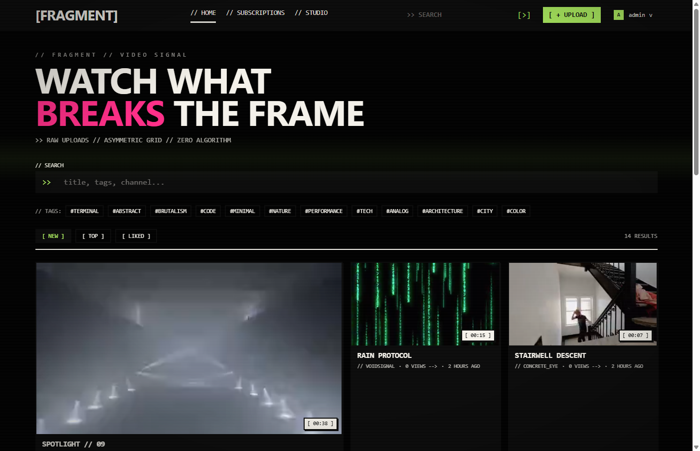</a>
      <sub><b>Home — Dark</b><br/>CRT-flavored dark theme with scanlines</sub>
    </td>
    <td align="center" width="33%">
      <a href="./docs/screenshots/catalog.png">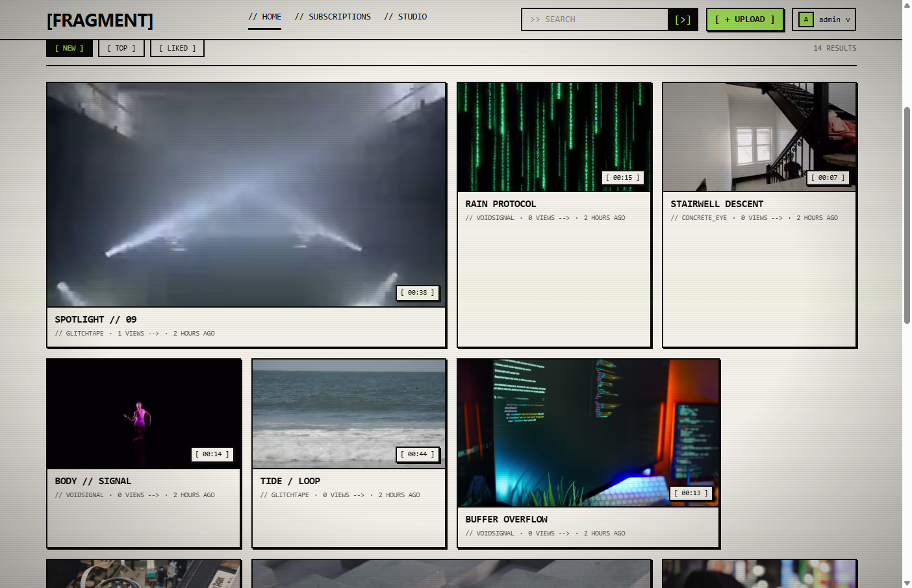</a>
      <sub><b>Catalog</b><br/>Mixed-aspect tiles, channel & duration meta</sub>
    </td>
  </tr>
</table>

### Watch experience

<table>
  <tr>
    <td align="center" width="33%">
      <a href="./docs/screenshots/video-detail.png"></a>
      <sub><b>Player + Detail</b><br/>HLS.js stream, metadata & related signals</sub>
    </td>
    <td align="center" width="33%">
      <a href="./docs/screenshots/comments.png">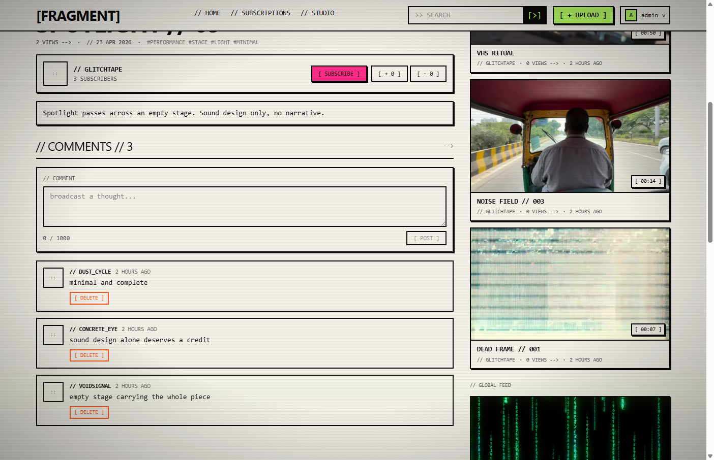</a>
      <sub><b>Comments</b><br/>Composer, owner-scoped delete actions</sub>
    </td>
    <td align="center" width="33%">
      <a href="./docs/screenshots/channel.png">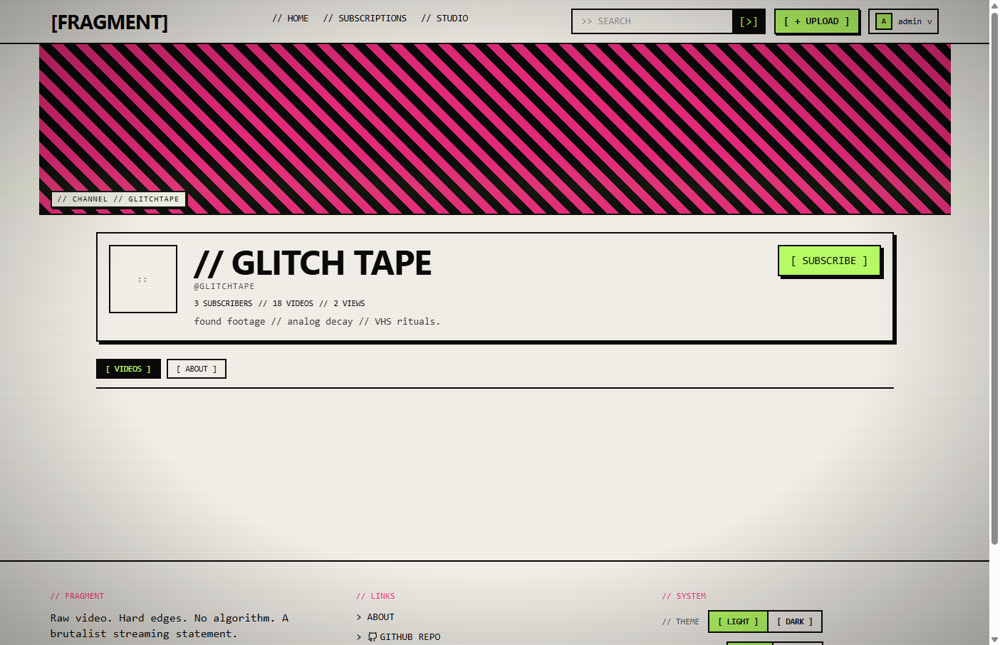</a>
      <sub><b>Channel</b><br/>Creator banner, subs count & video tabs</sub>
    </td>
  </tr>
</table>

### Authentication & personalization

<table>
  <tr>
    <td align="center" width="33%">
      <a href="./docs/screenshots/login.png">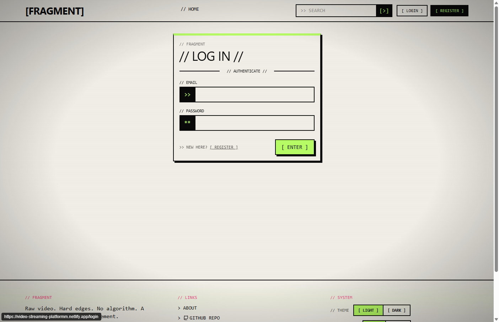</a>
      <sub><b>Login</b><br/>JWT email + password authentication</sub>
    </td>
    <td align="center" width="33%">
      <a href="./docs/screenshots/register.png">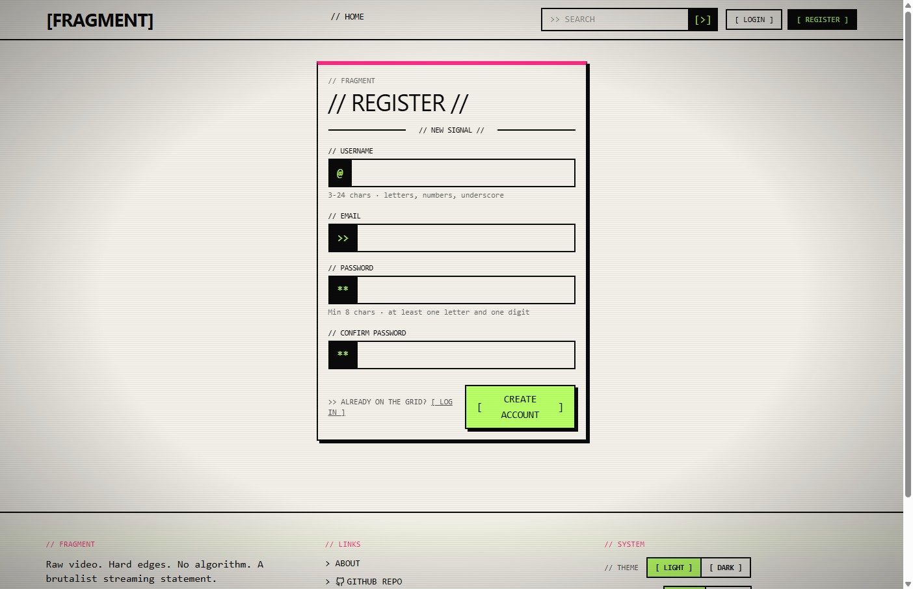</a>
      <sub><b>Register</b><br/>Zod-validated new account flow</sub>
    </td>
    <td align="center" width="33%">
      <a href="./docs/screenshots/subscriptions.png">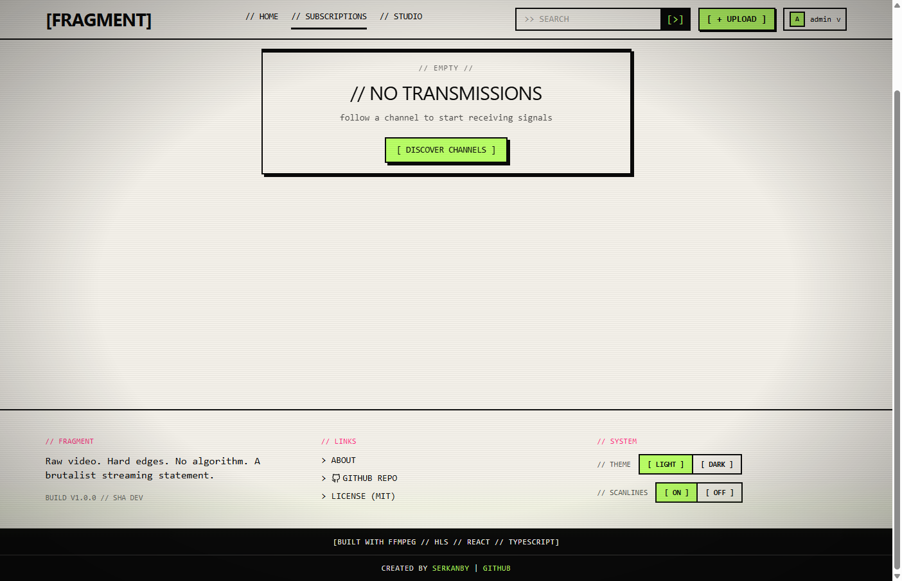</a>
      <sub><b>Subscriptions</b><br/>Curated feed of followed creators</sub>
    </td>
  </tr>
</table>

### Creator workflow

<table>
  <tr>
    <td align="center" width="33%">
      <a href="./docs/screenshots/upload.png"></a>
      <sub><b>Upload</b><br/>Drag-drop with size & duration constraints</sub>
    </td>
    <td align="center" width="33%">
      <a href="./docs/screenshots/studio.png">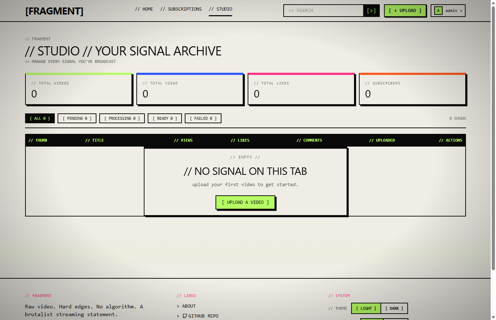</a>
      <sub><b>Studio</b><br/>KPI strip & status-aware archive table</sub>
    </td>
    <td align="center" width="33%">
      <a href="./docs/screenshots/appearance.png">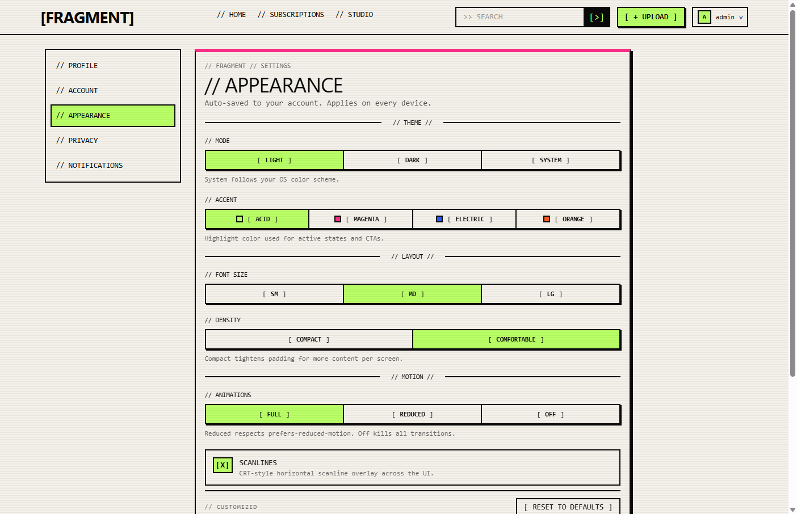</a>
      <sub><b>Appearance</b><br/>Theme, accent, density & motion controls</sub>
    </td>
  </tr>
</table>

### Admin control room

<table>
  <tr>
    <td align="center" width="33%">
      <a href="./docs/screenshots/admin.png"></a>
      <sub><b>Dashboard</b><br/>KPIs, status breakdown & storage telemetry</sub>
    </td>
    <td align="center" width="33%">
      <a href="./docs/screenshots/admin-users.png">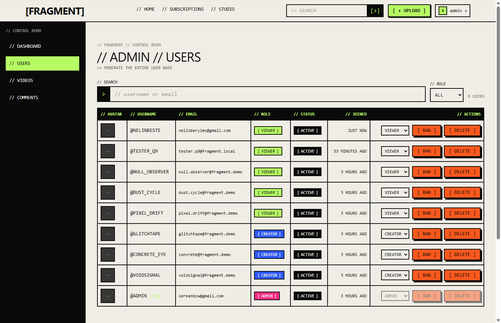</a>
      <sub><b>Users</b><br/>Role assignment, ban & delete with guardrails</sub>
    </td>
    <td align="center" width="33%">
      <a href="./docs/screenshots/admin-videos.png">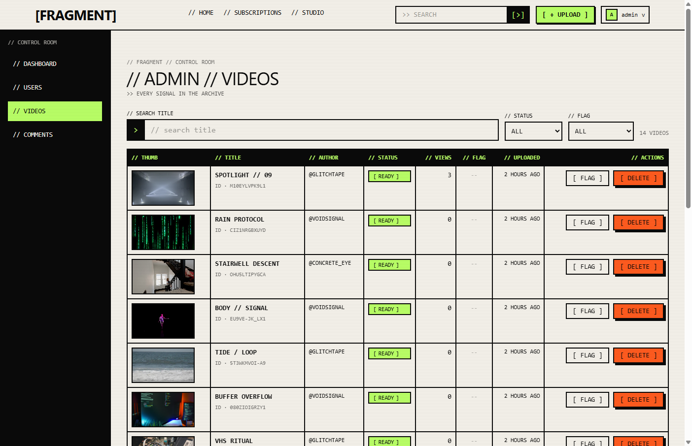</a>
      <sub><b>Videos</b><br/>Status filter, flagging & destructive actions</sub>
    </td>
  </tr>
  <tr>
    <td align="center" width="33%" colspan="3">
      <a href="./docs/screenshots/admin-comments.png">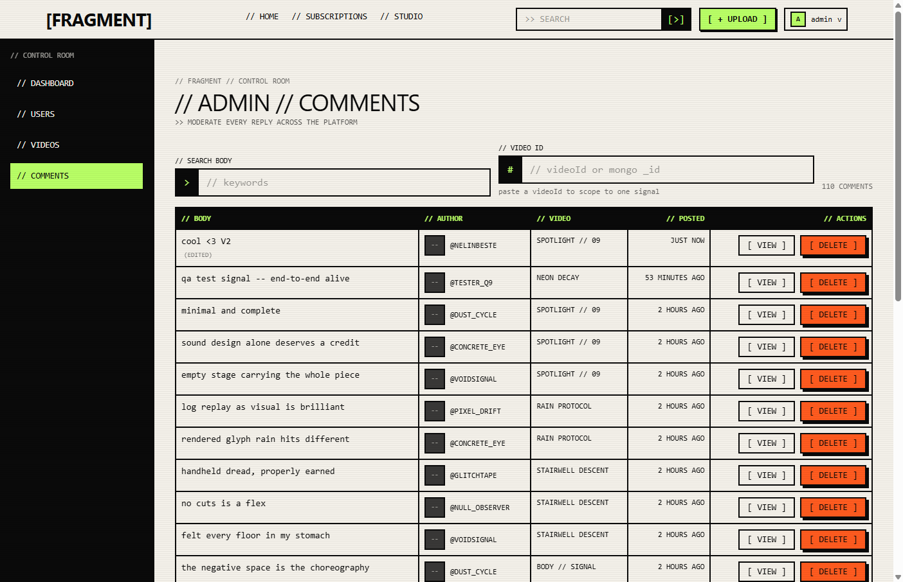</a>
      <sub><b>Comments moderation</b><br/>Full-text search, per-video scoping & bulk delete</sub>
    </td>
  </tr>
</table>

> All screenshot files live under `docs/screenshots/` as `kebab-case.png`. Re-capture against the live demo to keep parity with the deployed UI.

---

## Architecture

A high-level visual map of the system. Both diagrams render natively on GitHub thanks to Mermaid support.

### Domain Model

How the core collections relate to each other and how the FFmpeg pipeline produces stream-ready artifacts.

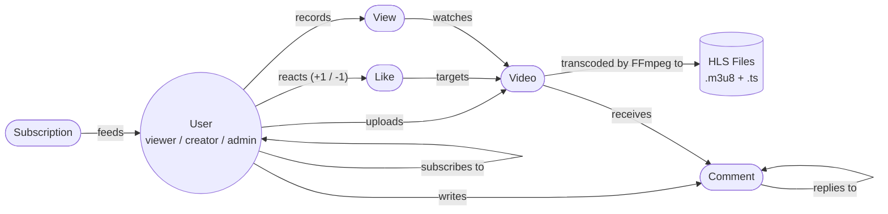

### Request Lifecycle

How a single browser action travels through the stack — from upload to playback.

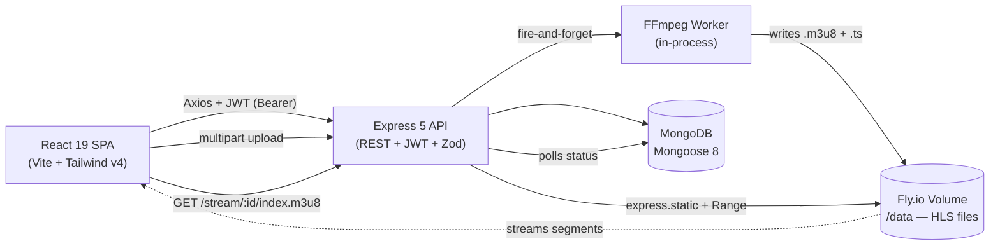

---

## Technologies

### Frontend

- **React 19**: Modern UI library with hooks and context for state management
- **Vite 8**: Lightning-fast build tool and dev server
- **TypeScript 5**: Strict type safety across the entire client
- **Tailwind CSS v4**: Utility-first CSS with the new `@tailwindcss/vite` plugin
- **React Router v7**: Client-side routing with nested layouts and route guards
- **React Player (HLS.js)**: HLS playback in every browser, not just Safari
- **Axios**: HTTP client with interceptors for JWT injection and error normalization
- **Lucide React**: Lightweight, tree-shakable icon set
- **React Hot Toast**: Accessible toast notifications

### Backend

- **Node.js 20+**: Modern server-side JavaScript runtime
- **Express 5**: Minimal web framework with native async error handling
- **TypeScript 5**: Strict mode (`noUncheckedIndexedAccess`, `exactOptionalPropertyTypes`) on the server too
- **MongoDB (Mongoose 8)**: NoSQL database with `InferSchemaType` for zero-duplication models
- **Multer 2**: Multipart upload handling with MIME whitelist and size caps
- **fluent-ffmpeg**: Node wrapper around FFmpeg for HLS transcoding and thumbnail extraction
- **Zod 3**: Runtime validation with shared schemas between client and server
- **JWT (jsonwebtoken)**: Stateless authentication with configurable expiry
- **bcryptjs**: Password hashing with configurable salt rounds (default 12)
- **Helmet, CORS, express-rate-limit**: Security middleware stack

### Shared & Infra

- **`@fragment/shared` workspace**: Zod schemas, enums, and TS types consumed by both client and server
- **MongoDB Atlas**: Production database (M0 free tier compatible)
- **Fly.io**: Server hosting with a 3 GB persistent volume mounted at `/data`
- **Netlify**: Client hosting with `_headers` for HTTPS, caching, and security policies
- **GitHub Actions**: Zero-install CI/CD pipeline that builds the Docker image, deploys to Fly.io, and runs the seed scripts

---

## Installation

### Prerequisites

- **Node.js** v20+ and **npm** v10+ (workspaces required)
- **MongoDB** v6+ — local instance or [MongoDB Atlas](https://www.mongodb.com/atlas) free tier
- **FFmpeg + FFprobe** v4.4+ — must be installed on system `PATH`. Verify with `ffmpeg -version` and `ffprobe -version`
- **Disk** ≥ 2 GB free for local `uploads/` (production runs on a 3 GB Fly.io volume)
- **`flyctl`** (optional) — only required for production deployment

> Without FFmpeg on `PATH`, every upload fails at the transcoding stage. Windows users: download a static build from [ffmpeg.org/download](https://ffmpeg.org/download.html) and add `bin/` to `PATH`. macOS: `brew install ffmpeg`. Debian/Ubuntu: `sudo apt install -y ffmpeg`.

### Local Development

**1. Clone the repository:**

```bash
git clone https://github.com/Serkanbyx/video-streaming-platform.git
cd video-streaming-platform
```

**2. Install all workspaces in one pass:**

```bash
npm install
```

This installs `shared`, `server`, and `client` together via npm workspaces.

**3. Build the shared package once before the first dev run:**

```bash
npm run build --workspace=@fragment/shared
```

The server and client resolve types from `shared/dist/`, so the shared package must exist before either side compiles.

**4. Set up environment variables:**

```bash
cp server/.env.example server/.env
cp client/.env.example client/.env
```

**`server/.env`**

```env
NODE_ENV=development
PORT=5000
MONGO_URI=mongodb://127.0.0.1:27017/fragment
JWT_SECRET=replace_with_32_plus_random_chars
JWT_EXPIRES_IN=7d
BCRYPT_SALT_ROUNDS=12
CLIENT_ORIGIN=http://localhost:5173
UPLOAD_DIR=./uploads
MAX_UPLOAD_SIZE_MB=200
MAX_VIDEO_DURATION_SECONDS=600
SEED_ADMIN_EMAIL=admin@fragment.local
SEED_ADMIN_USERNAME=admin
SEED_ADMIN_PASSWORD=change-me-strong-password
```

Generate a secure `JWT_SECRET`:

```bash
node -e "console.log(require('crypto').randomBytes(32).toString('hex'))"
```

**`client/.env`**

```env
VITE_API_URL=http://localhost:5000
```

**5. Seed the first admin and (optionally) demo content:**

```bash
npm run seed:admin
npm run seed:demo
```

The demo seed is idempotent. Drop 14 short MP4s (≤60s, ≤10 MB, 720p) into `server/src/seed/demo-assets/videos/` using the filenames listed in `metadata.json`. Source clips from [Pexels Videos](https://www.pexels.com/videos/), [Pixabay](https://pixabay.com/videos/), [Coverr](https://coverr.co/), or [Mixkit](https://mixkit.co/free-stock-video/).

**6. Run the application:**

```bash
# Terminal 1 — Backend (http://localhost:5000)
npm run dev:server

# Terminal 2 — Frontend (http://localhost:5173)
npm run dev:client
```

Log in with the admin account you seeded.

---

## Usage

1. **Register** a new account at `/register` — accounts default to the `viewer` role.
2. **Become a creator** from any account by hitting `POST /api/users/me/become-creator` (or via the UI button on the profile page).
3. **Upload a video** at `/studio/upload` — drag a file, fill in title/description, and watch the status poller flip from `processing` to `ready`.
4. **Watch & interact** — open any video, scrub through the HLS stream, react with like/dislike, post nested comments, and subscribe to creators.
5. **Personalize** — toggle light/dark/system themes, switch accent colors, and tune density/animation preferences in `/settings/appearance` (all persisted server-side).
6. **Moderate (admin only)** — open `/admin` to see KPIs, manage users, force-delete videos/comments, and run disk cleanup with dry-run mode.
7. **Logout** from the navbar dropdown to clear the JWT and return to the public catalog.

---

## How It Works?

### Authentication Flow

The client stores the JWT in `localStorage` and an Axios request interceptor injects it as a `Bearer` token on every API call. A response interceptor catches `401` responses, clears the token, and redirects to `/login`.

```ts
// client/src/api/axios.ts
api.interceptors.request.use((config) => {
  const token = localStorage.getItem('fragment.token');
  if (token) config.headers.Authorization = `Bearer ${token}`;
  return config;
});

api.interceptors.response.use(
  (res) => res,
  (err) => {
    if (err.response?.status === 401) {
      localStorage.removeItem('fragment.token');
      window.location.assign('/login');
    }
    return Promise.reject(err);
  },
);
```

### HLS Transcoding Pipeline

When a creator uploads a video, the request flow is:

1. **Multer** writes the raw file to `uploads/raw/` (whitelisted MIME, capped size).
2. The controller creates a `Video` document with `status: 'pending'` and **immediately responds** to the client.
3. A fire-and-forget `processVideo(videoId)` call kicks off in the background.
4. **FFprobe** validates duration; **FFmpeg** transcodes to single-bitrate HLS (`-c:v libx264 -hls_time 10 -hls_segment_type mpegts`) into `uploads/processed/<videoId>/`.
5. A thumbnail is extracted from a configurable timestamp.
6. The `Video` document is patched to `status: 'ready'` (or `'failed'` on error) and the raw file is unlinked.
7. The client polls `GET /api/videos/:id/status` until the status flips, then reveals the player.

### Shared Type Contract

The `@fragment/shared` workspace exports Zod schemas that double as runtime validators **and** compile-time types:

```ts
// shared/schemas/video.schema.ts
export const createVideoSchema = z.object({
  title: z.string().min(3).max(120),
  description: z.string().max(2000).optional(),
  visibility: z.enum(['public', 'unlisted']).default('public'),
});

export type CreateVideoInput = z.infer<typeof createVideoSchema>;
```

The same schema is used by the `validate(createVideoSchema)` Express middleware and by the React upload form — drift is impossible.

---

## API Endpoints

All routes are mounted under `/api`. Responses follow the uniform shape `{ success: true, data } | { success: false, message, requestId?, errors? }`. Auth endpoints require `Authorization: Bearer <token>`.

### Auth — `/api/auth`

| Method   | Endpoint            | Auth | Description                                              |
| -------- | ------------------- | ---- | -------------------------------------------------------- |
| `POST`   | `/register`         | No   | Create account (rate-limited)                            |
| `POST`   | `/login`            | No   | Issue JWT (rate-limited)                                 |
| `GET`    | `/me`               | Yes  | Current user profile                                     |
| `PATCH`  | `/me`               | Yes  | Update own profile (username, bio, avatar URL)           |
| `POST`   | `/change-password`  | Yes  | Change password (requires current password, rate-limited) |
| `DELETE` | `/me`               | Yes  | Delete own account (requires current password)           |

### Users — `/api/users`

| Method  | Endpoint              | Auth     | Description                                       |
| ------- | --------------------- | -------- | ------------------------------------------------- |
| `GET`   | `/me/preferences`     | Yes      | Read appearance / privacy / notification prefs    |
| `PATCH` | `/me/preferences`     | Yes      | Update preferences                                |
| `POST`  | `/me/become-creator`  | Yes      | Promote viewer → creator                          |
| `GET`   | `/me/history`         | Yes      | Personal watch history                            |
| `GET`   | `/:username`          | Optional | Public channel profile                            |

### Videos — `/api/videos`

| Method   | Endpoint                       | Auth              | Description                                              |
| -------- | ------------------------------ | ----------------- | -------------------------------------------------------- |
| `GET`    | `/`                            | Optional          | List videos with search, sort, pagination                |
| `GET`    | `/mine`                        | Creator+          | List own videos (any status)                             |
| `GET`    | `/by-channel/:userId`          | Optional          | Videos for a specific channel                            |
| `POST`   | `/upload`                      | Creator+          | Upload + trigger async HLS transcode (rate-limited)      |
| `GET`    | `/:videoId`                    | Optional          | Video detail                                             |
| `GET`    | `/:videoId/status`             | Optional          | Polling endpoint for processing status                   |
| `GET`    | `/:videoId/recommendations`    | Optional          | Related videos (creator-overlap based)                   |
| `PATCH`  | `/:videoId`                    | Creator+ (owner)  | Update title, description, visibility                    |
| `PATCH`  | `/:videoId/view`               | Optional          | Record a deduplicated view (rate-limited)                |
| `DELETE` | `/:videoId`                    | Creator+ (owner)  | Delete video + HLS files + cascade                       |

### Streaming — `/api/stream`

| Method | Endpoint                       | Auth | Description                                       |
| ------ | ------------------------------ | ---- | ------------------------------------------------- |
| `GET`  | `/:videoId/index.m3u8`         | No   | HLS playlist (served by `express.static`)         |
| `GET`  | `/:videoId/segment*.ts`        | No   | HLS segments (HTTP Range supported natively)      |
| `GET`  | `/:videoId/thumbnail.jpg`      | No   | Auto-generated thumbnail                          |

### Likes — `/api/likes`

| Method   | Endpoint        | Auth     | Description                            |
| -------- | --------------- | -------- | -------------------------------------- |
| `GET`    | `/:videoId/me`  | Optional | Current user's reaction (or `null`)    |
| `POST`   | `/:videoId`     | Yes      | Set reaction (`+1` like / `-1` dislike) |
| `DELETE` | `/:videoId`     | Yes      | Remove reaction                        |

### Comments — `/api/comments`

| Method   | Endpoint                  | Auth          | Description                                    |
| -------- | ------------------------- | ------------- | ---------------------------------------------- |
| `GET`    | `/video/:videoId`         | Optional      | Top-level comments for a video                 |
| `GET`    | `/:commentId/replies`     | Optional      | Nested replies                                 |
| `POST`   | `/`                       | Yes           | Create comment or reply (rate-limited)         |
| `PATCH`  | `/:commentId`             | Yes (owner)   | Edit own comment                               |
| `DELETE` | `/:commentId`             | Yes (owner)   | Delete own comment (cascades replies)          |

### Subscriptions — `/api/subscriptions`

| Method   | Endpoint                  | Auth     | Description                                    |
| -------- | ------------------------- | -------- | ---------------------------------------------- |
| `GET`    | `/me`                     | Yes      | Channels the current user subscribes to        |
| `GET`    | `/me/feed`                | Yes      | Latest videos from subscribed channels         |
| `GET`    | `/:channelId/status`      | Optional | Whether the current user is subscribed         |
| `POST`   | `/:channelId`             | Yes      | Subscribe to channel                           |
| `DELETE` | `/:channelId`             | Yes      | Unsubscribe                                    |

### Admin — `/api/admin` (admin only, rate-limited)

| Method   | Endpoint                            | Description                                                         |
| -------- | ----------------------------------- | ------------------------------------------------------------------- |
| `GET`    | `/dashboard/stats`                  | KPIs, status breakdown, top videos, recent activity                 |
| `GET`    | `/users`                            | List/search users                                                   |
| `PATCH`  | `/users/:userId/role`               | Change role                                                         |
| `PATCH`  | `/users/:userId/ban`                | Toggle ban                                                          |
| `DELETE` | `/users/:userId`                    | Force-delete user                                                   |
| `GET`    | `/videos`                           | List/search/filter all videos                                       |
| `PATCH`  | `/videos/:videoId/flag`             | Flag/unflag video                                                   |
| `DELETE` | `/videos/:videoId`                  | Force-delete video                                                  |
| `GET`    | `/comments`                         | List/search all comments                                            |
| `DELETE` | `/comments/:commentId`              | Force-delete comment                                                |
| `GET`    | `/maintenance/disk`                 | Disk usage report (`ok` / `warn` / `critical`)                      |
| `POST`   | `/maintenance/cleanup`              | Run cleanup (raw / orphans / failed; supports dry-run)              |

### Health

| Method | Endpoint        | Description                       |
| ------ | --------------- | --------------------------------- |
| `GET`  | `/api/health`   | Liveness probe (uptime + status)  |

> Auth endpoints require `Authorization: Bearer <token>`. Rate limits use standard `RateLimit-*` headers exposed via CORS.

---

## Project Structure

A clean monorepo layout with three TypeScript workspaces (`shared`, `server`, `client`) plus a `docs/` folder for the build playbook and migration plans. Each panel below is collapsible — expand the one you care about.

<details open>
<summary><b>Server</b> — Express 5 + Mongoose 8 + FFmpeg</summary>

```
server/
├── src/
│   ├── config/         # env (Zod-validated), db connection
│   ├── controllers/    # auth, user, video, like, comment, subscription, admin
│   ├── middleware/     # auth, role, validate, rateLimit, sanitize, error
│   ├── models/         # User, Video, View, Like, Comment, Subscription
│   ├── routes/         # one file per resource group
│   ├── services/       # ffmpeg.service, processing.service
│   ├── utils/          # logger, asyncHandler, httpError, pickFields
│   ├── seed/           # seedAdmin.ts, seedDemo.ts, demo-assets/
│   ├── types/          # express.d.ts (req.user augmentation)
│   └── index.ts        # Express bootstrap + graceful shutdown
├── scripts/            # copy-seed-assets, rewrite-shared-aliases (postbuild)
├── uploads/
│   ├── raw/            # Multer destination (gitkeep)
│   └── processed/      # FFmpeg HLS output (gitkeep)
├── .env.example
├── Dockerfile
└── package.json
```

</details>

<details>
<summary><b>Client</b> — React 19 + Vite + Tailwind v4</summary>

```
client/
├── public/             # Static assets, favicon, _headers
├── src/
│   ├── api/            # Axios instance + endpoint wrappers
│   ├── context/        # AuthContext, PreferencesContext
│   ├── hooks/          # useAuth, usePreferences, useDebounce
│   ├── components/
│   │   ├── brutal/     # BrutalButton, BrutalCard, BrutalToggle
│   │   ├── layout/     # Navbar, Footer, AdminLayout
│   │   ├── video/      # VideoCard, VideoGrid, VideoPlayer
│   │   ├── comment/    # CommentList, CommentItem, CommentForm
│   │   ├── upload/     # UploadDropzone, ProcessingStatus
│   │   ├── studio/     # StudioVideoRow, StatusBadge
│   │   ├── admin/      # KPIWidget, DiskWidget, ModerationTable
│   │   ├── feedback/   # AsciiSpinner, EmptyState, ErrorBlock
│   │   └── guards/     # AuthRoute, CreatorRoute, AdminRoute
│   ├── pages/          # Home, VideoDetail, Upload, Studio, Channel
│   │   ├── settings/   # Profile, Account, Appearance, Privacy
│   │   └── admin/      # Dashboard, Users, Videos, Comments
│   ├── services/       # business logic wrapping api/
│   ├── utils/
│   ├── App.tsx         # router + providers
│   ├── main.tsx        # entry point
│   └── index.css       # Tailwind v4 + brutalist tokens
├── .env.example
├── vite.config.ts
└── package.json
```

</details>

<details>
<summary><b>Repository root</b> — shared package, docs & deploy config</summary>

```
video-streaming-platform/
├── client/             # → see Client panel above
├── server/             # → see Server panel above
├── shared/             # @fragment/shared workspace
│   ├── constants/      # USER_ROLES, VIDEO_STATUSES, ...
│   ├── schemas/        # Zod schemas (auth, user, video, comment, admin)
│   ├── types/          # Shared TS interfaces (User, Video, ...)
│   └── package.json
├── docs/
│   ├── BUILD-GUIDE.md       # Original 42-step build playbook
│   ├── MIGRATION-TO-B2.md   # Future B2 + Cloudflare CDN plan
│   └── screenshots/         # README screenshots
├── .github/
│   └── workflows/      # CI/CD pipeline (deploy to Fly.io)
├── fly.toml            # Fly.io app + 3 GB volume + release_command
├── tsconfig.base.json  # Strict TS settings shared by all workspaces
├── tsconfig.json       # Composite project references
├── package.json        # Root workspaces + scripts
└── README.md
```

</details>

---

## Security

- **JWT Authentication** — bcrypt-hashed passwords (configurable salt rounds, default 12), signed JWTs with configurable expiry, secret enforced ≥ 32 chars in production.
- **Role-Based Middleware** — `protect`, `creatorOrAdmin`, `adminOnly` plus ownership checks on every mutation route. Self-protection prevents admins from demoting, banning, or deleting themselves; a last-admin guard prevents accidental lockout.
- **Mass-Assignment Protection** — controllers `pickFields()` from `req.body`; Mongoose schemas use `select: false` on sensitive fields (password hash).
- **Zod Validation** — every request body, params, and query validated against shared schemas. Schemas live in `@fragment/shared` and are reused on the client.
- **Custom NoSQL Sanitization** — Express 5–compatible middleware strips `$` and `.` keys (replaces the deprecated `express-mongo-sanitize`).
- **Rate Limiting** — separate buckets: `globalLimiter` for `/api/*`, `authLimiter` for register/login/password, `uploadLimiter`, `viewLimiter`, `commentLimiter`, `adminLimiter`. Standard `RateLimit-*` headers exposed via CORS.
- **Helmet & CORS** — secure defaults; `x-powered-by` disabled; single-origin CORS from `CLIENT_ORIGIN` with credentials enabled.
- **Multer Hardening** — MIME whitelist, file-size cap (`MAX_UPLOAD_SIZE_MB`), duration cap (`MAX_VIDEO_DURATION_SECONDS`), dedicated `uploads/raw/` destination outside the served directory.
- **HLS Streaming** — mounted **before** the global API rate limiter so segment fetches never starve JSON traffic; `dotfiles: 'deny'`, `index: false`, immutable cache headers.
- **Request IDs + Structured Logging** — every request tagged with `X-Request-Id`; the same id flows into error responses for traceability.
- **Secrets Hygiene** — `.env` and `uploads/raw/*` / `uploads/processed/*` never committed; production secrets injected via Fly.io secrets, not files.

---

## Deployment

Production runs as a **zero-install GitHub Actions pipeline**: every push to `main` builds the Docker image, pushes it to Fly.io, and runs the admin + demo seeds via the `release_command` in `fly.toml`.

### Backend — Fly.io

1. Install `flyctl` and authenticate: `flyctl auth login`.
2. Launch the app from the repo root: `flyctl launch --no-deploy` (a `fly.toml` is already committed, so accept defaults).
3. Create a 3 GB persistent volume in your chosen region: `flyctl volumes create fragment_data --size 3 --region ams`.
4. Set production secrets:

| Variable                   | Value                                    |
| -------------------------- | ---------------------------------------- |
| `MONGO_URI`                | MongoDB Atlas connection string          |
| `JWT_SECRET`               | 64-char random hex (≥ 32 chars enforced) |
| `CLIENT_ORIGIN`            | `https://video-streaming-platformm.netlify.app` |
| `SEED_ADMIN_EMAIL`         | Admin login email                        |
| `SEED_ADMIN_USERNAME`      | Admin username                           |
| `SEED_ADMIN_PASSWORD`      | Strong password                          |
| `DEMO_PASSWORD`            | Demo accounts password (optional)        |

Set them with `flyctl secrets set KEY=value` and deploy with `flyctl deploy`. The `release_command` will run `seed:admin:prod` and `seed:demo:prod` on every release.

> The Docker image bundles `ffmpeg` via `apt install ffmpeg`, so no extra runtime setup is needed.

### Frontend — Netlify

1. Connect the repository to Netlify and set the **base directory** to `client/`.
2. Build command: `npm run build`. Publish directory: `client/dist`.
3. Add the production env var:

| Variable        | Value                                   |
| --------------- | --------------------------------------- |
| `VITE_API_URL`  | `https://<your-fly-app>.fly.dev`        |

4. Deploy. The `client/public/_headers` file enables HSTS, immutable asset caching, and a strict referrer policy automatically.

> Live demo: <https://video-streaming-platformm.netlify.app/>

---

## Features in Detail

### Completed Features

- ✅ Full HLS pipeline (Multer → FFmpeg → `.m3u8` + `.ts` segments → range-aware streaming)
- ✅ JWT auth with bcrypt + Zod-validated registration / login / password change
- ✅ Three roles (viewer / creator / admin) with strict middleware hierarchy
- ✅ Drag-and-drop upload with progress, status polling, and auto-thumbnails
- ✅ Nested comments + optimistic like/dislike with one-reaction-per-user
- ✅ Channel subscriptions with personal feed and watch-history deduplication
- ✅ Recommendation engine based on creator overlap
- ✅ Admin KPI dashboard, moderation tools, disk-quota alerting, orphan cleanup
- ✅ Theme system (light / dark / system + 4 accents) persisted server-side
- ✅ Idempotent seed scripts (`seed:admin`, `seed:demo`) with production variants

### Future Features

- [ ] **Multi-bitrate adaptive streaming (ABR)** — encode multiple renditions and a master `.m3u8`
- [ ] **BullMQ + Redis worker queue** — move FFmpeg processing out-of-process for concurrency
- [ ] **Object storage + CDN** — migrate to Backblaze B2 + Cloudflare per [`docs/MIGRATION-TO-B2.md`](./docs/MIGRATION-TO-B2.md)
- [ ] **Email & push notifications** — wire the existing `newSubscriber` / `newComment` flags to real channels
- [ ] **Avatar file uploads** — currently URL-only to reduce moderation surface
- [ ] **Private visibility** with auth-gated stream tokens
- [ ] **Live streaming** support (currently VOD only)
- [ ] **Captions, transcripts & chapters**

---

## Contributing

1. **Fork** the repository.
2. **Create a feature branch:** `git checkout -b feat/your-feature-name`
3. **Commit your changes** following the convention below.
4. **Push to your fork:** `git push origin feat/your-feature-name`
5. **Open a Pull Request** against `main`.

A green `npm run type-check` from the repo root is the single source of truth before any commit or deploy.

| Prefix      | Description                            |
| ----------- | -------------------------------------- |
| `feat:`     | New feature                            |
| `fix:`      | Bug fix                                |
| `refactor:` | Code refactoring                       |
| `docs:`     | Documentation changes                  |
| `chore:`    | Maintenance and dependency updates     |

---

## License

This project is licensed under the **MIT License** — see the [LICENSE](./LICENSE) file for details.

---

## Developer

**Serkan Bayraktar**

- 🌐 Website: [serkanbayraktar.com](https://serkanbayraktar.com/)
- 💻 GitHub: [@Serkanbyx](https://github.com/Serkanbyx)
- 📧 Email: [serkanbyx1@gmail.com](mailto:serkanbyx1@gmail.com)

---

## Acknowledgments

- [**FFmpeg**](https://ffmpeg.org/) — the engine behind every byte of video on this platform
- [**HLS.js**](https://github.com/video-dev/hls.js/) — making HLS work in every browser, not just Safari
- [**MongoDB Atlas**](https://www.mongodb.com/atlas) — free-tier database hosting
- [**Fly.io**](https://fly.io/) — server hosting with persistent volumes on the free plan
- [**Netlify**](https://www.netlify.com/) — frontend hosting with edge caching
- [**Zod**](https://zod.dev/) — the schema library that ties client and server together
- [**Tailwind CSS**](https://tailwindcss.com/) and the brutalist web movement for the visual language

---

## Contact

- 🐛 **Issues:** [Open a GitHub issue](https://github.com/Serkanbyx/video-streaming-platform/issues)
- 📧 **Email:** [serkanbyx1@gmail.com](mailto:serkanbyx1@gmail.com)
- 🌐 **Website:** [serkanbayraktar.com](https://serkanbayraktar.com/)

---

⭐ If you like this project, don't forget to give it a star!
